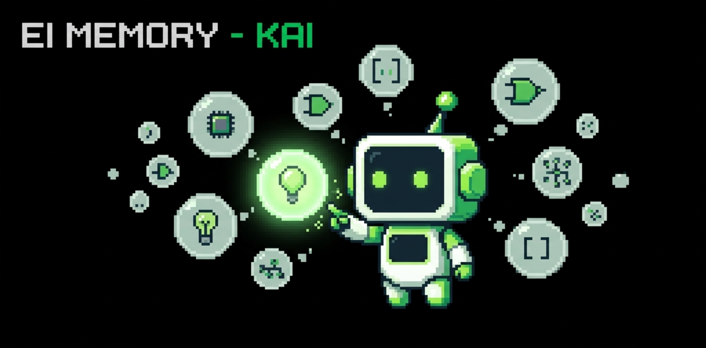
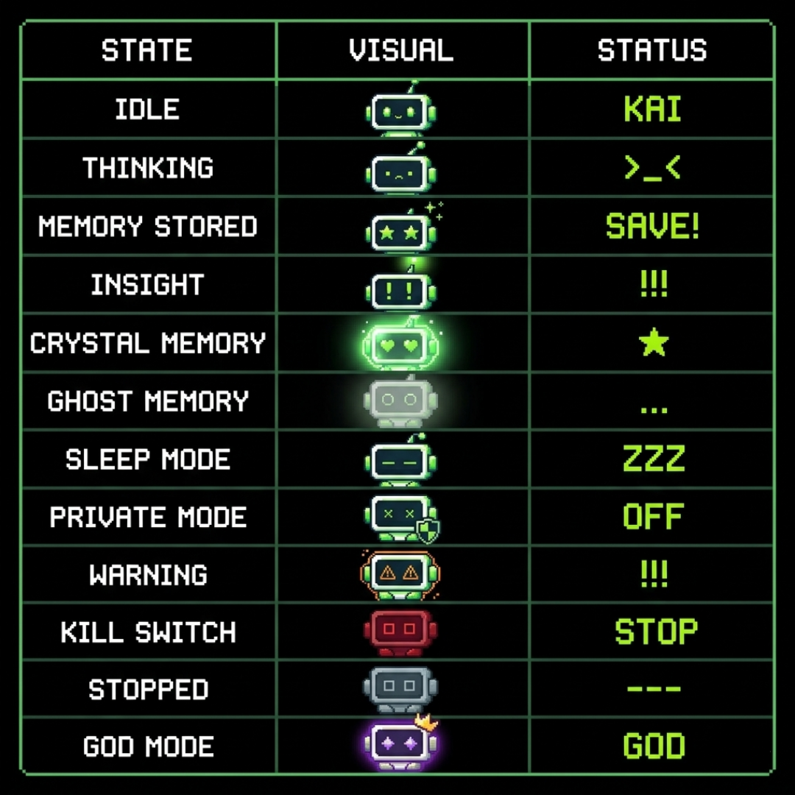
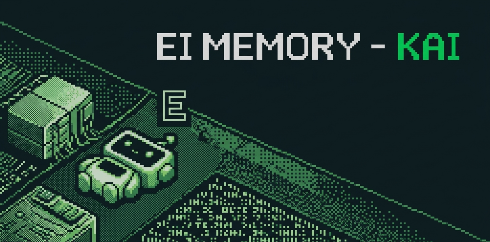
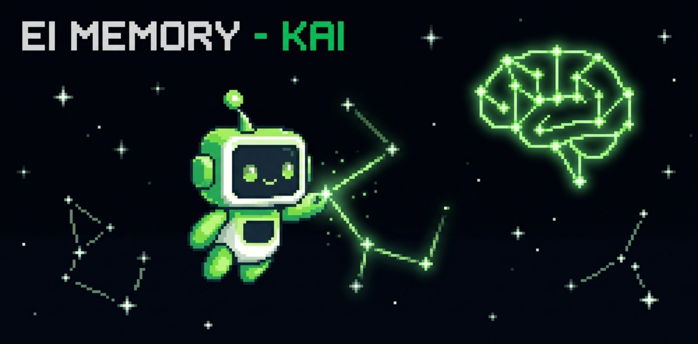
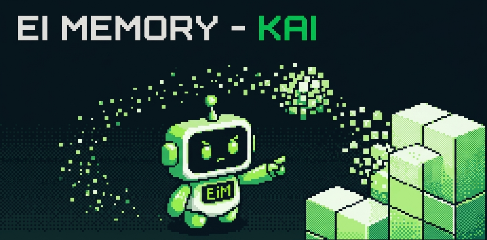
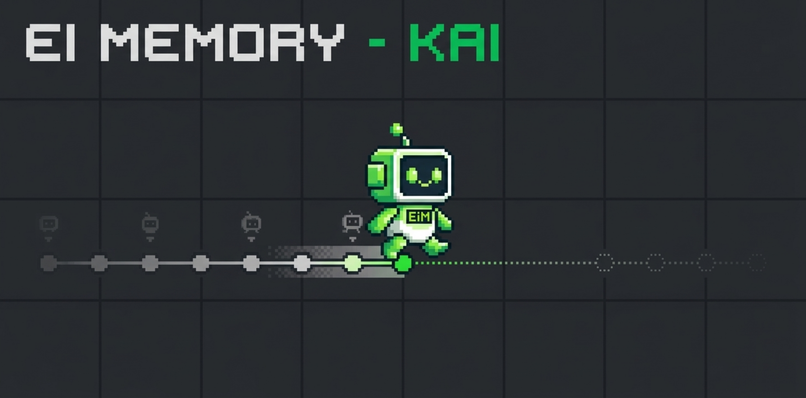

# KAI — Ei Memory



**The memory intelligence layer that sits underneath your entire digital life.**

*Zero Cost · Runs Offline · Owned Entirely By You · No Servers · No Subscriptions*

---

[](LICENSE)
[](https://python.org)
[]()
[]()
[]()

</div>

---

## The Problem

Every AI you use today meets you as a stranger. **Every single time.**

You open ChatGPT — explain your goals again.
You open Gemini — describe your project again.
You switch to Claude — repeat your context again.

This happens every session. Every tool. Every day. **Forever.**

GPT Memory stores facts inside ChatGPT. Locked there. Can't use it in Gemini.
Gemini Memory does the same. Locked inside Google. Can't use it anywhere else.
Neither works offline. Neither costs nothing. Neither protects your integrity.
Neither forgets when you ask it to. Neither knows you across your whole life.

**KAI ends this. Permanently.**

---

## What Is KAI

KAI is not an app. It is a **presence**.

Think about WiFi. You never "open WiFi." You never "use WiFi." You just work — and everything benefits from WiFi being underneath. When it works, you forget it exists. When it stops, everything feels broken.

**KAI is WiFi for your intelligence.**

You just live your digital life. You just work on EiCity. You just talk to ChatGPT. You just prepare for your interview. And KAI is underneath — remembering what matters, growing your ideas while you sleep, making every AI you touch smarter about you, protecting your integrity when you need to prove you went alone.

The chatbot window you type into? **That is not KAI.** That is a window into KAI. Close the window — KAI keeps running. KAI keeps remembering. KAI keeps growing your ideas. KAI keeps protecting you.

**KAI is presence, not product.**

---

## What Makes KAI Different

| Feature | GPT Memory | Gemini Memory | Mem0/MemGPT | **KAI** |
|---------|-----------|--------------|-------------|---------|
| Works across apps | ❌ ChatGPT only | ❌ Google only | ⚠️ Dev tool | ✅ Universal layer |
| Offline capability | ❌ Always needs internet | ❌ Always needs internet | ❌ Cloud only | ✅ Full offline |
| Cost | ❌ Needs Plus subscription | ❌ Needs Workspace | ❌ API costs | ✅ Zero rupees |
| Privacy — data location | ❌ OpenAI servers | ❌ Google servers | ❌ Their servers | ✅ Your device only |
| Controlled forgetting | ❌ All or nothing | ❌ All or nothing | ❌ None | ✅ Ghost Memory |
| Integrity protection | ❌ Not addressed | ❌ Not addressed | ❌ Not addressed | ✅ Freedom modes + receipts |
| Idea evolution | ❌ Static notes | ❌ Static notes | ❌ None | ✅ Living roadmaps |
| Safety protocol | ❌ None | ❌ None | ❌ None | ✅ AEGIS + kill switch |
| 100-persona debate | ❌ | ❌ | ❌ | ✅ Actor output |
| Sleep consolidation | ❌ | ❌ | ❌ | ✅ 6-phase nightly |
| Memory initiated contact | ❌ | ❌ | ❌ | ✅ Through connected apps |
| Named layer platform | ❌ | ❌ | ❌ | ✅ Build your own KAI |

---

## Install

```bash
# Clone
git clone https://github.com/GaneshEiGo/kai-ei-memory.git
cd kai-ei-memory

# Install everything
pip install -e .

# Download spaCy model
python -m spacy download en_core_web_sm

# Copy and fill in your free API keys
cp .env.example .env

# Start KAI
python -m kai
```

**Base install: ~116MB. Works immediately.**

PIXEL-E appears in your system tray. KAI is running.

### Optional: Full Offline AI

```
//upgrade offline
```

Downloads Phi-3 Mini (~2.3GB). After that, KAI works with **zero internet, forever**.

---

## Quick Start

KAI has two modes: **just talk** and **use commands**.

```
You:  just solved the EiCity renderer problem after 3 days stuck!!

KAI:  ★  Breakthrough stored.
      EiCity — Architecture phase updated.
      JavaScript + Canvas skills strengthened.
      
      This is a crystal memory candidate.
      Three days of persistence leading to a breakthrough.
      Mark it permanently? [Y/N]
```

```
You:  //interview prep data analyst

KAI:  YOUR STORY:
      EEE graduate who discovered product thinking naturally.
      Got Google APM interview without preparing.
      That proves something the CGPA doesn't capture.
      
      STRONGEST POINTS:
      → Credit Risk Engine: 150K records, PD×LGD×EAD, AUC 0.71
      → Portfolio Analytics: 10K Monte Carlo, Sharpe ratio, Power BI
      → EiCity: market visualization — shows you think in systems
      
      QUESTIONS TO EXPECT:
      → "Walk me through a technical project" → Credit Risk Engine
      → "Tell me about yourself" → [your specific story]
      → "CGPA is 7.2?" → Address directly. Results speak louder.
      
      ONE THING:
      You belong in this room.
```

```
You:  //debate should I focus on building KAI or apply for jobs first

KAI:  Complexity: 58/100 — launching 42-persona debate...
      
      [Wave 1: Opening positions from 42 perspectives...]
      [Wave 2: Internal camp debates...]
      [Wave 3: Cross-camp conflict...]
      [Wave 5: Synthesis]
      
      SYNTHESIS (Level 4 — Actionable):
      DO THIS NOW: Apply to 5 companies this week while building.
      WHY: Job applications take 4-6 weeks to close. KAI build
           takes 10 days. These timelines don't conflict.
      WATCH OUT FOR: Using "building KAI" as avoidance of rejection.
      SUCCESS LOOKS LIKE: First interview response AND Phase 1 done
                          by end of month.
```

---

## PIXEL-E — The Soul of KAI

PIXEL-E is the only visible sign that something powerful is running underneath your device. A small green pixel robot in your system tray. Pure pixel art. 32×32 grid. Maximum expression from minimum pixels.

```
PIXEL-E EXPRESSION GUIDE:

<p align="center">
  
</p>

**State color rule:** When any special state activates, the body green **disappears completely** and the state color replaces it entirely. No mixing. When the state ends, green returns.

**PIXEL-E evolves with you:**
- Day 1: 24×24, simple, 8 expressions
- Month 1: Full 32×32, all 13 expressions unlocked
- Year 1: Golden pixel tip on antenna. Special anniversary animation.

*Like a Tamagotchi met a terminal. Technical enough to trust. Warm enough to welcome.*

---

## Memory System

### How Memory Actually Works

KAI never stores your words. It stores the **meaning** extracted from your words.

```
YOU TYPE:
  "finally solved it. the eicity renderer was broken for 3 days.
   used canvas instead of react and it just works"

WHAT GETS STORED:
  {
    entity:        "EiCity",
    action:        "solved",
    blocker:       "renderer",
    duration:      "3 days",
    solution:      "Canvas over React",
    breakthrough:  true,
    skill_signal:  "JavaScript",
    emotion:       "relieved + proud",
    importance:    0.91,
    date:          "2026-03-21",
    time_of_day:   "evening",
    life_stage:    "final_year_building"
  }

ORIGINAL WORDS: discarded
MEANING: preserved forever
```

### 7-Layer Noise Filter

**95% of everything you type is discarded.** Only signal survives.

```
Layer 1: Noise Gate        — "hey" "ok" "lol" → DISCARD
Layer 2: Redundancy Kill   — already stored? → MERGE, not duplicate
Layer 3: Context Validate  — adds zero new info? → DISCARD
Layer 4: Importance Threshold — score < 0.30? → SESSION ONLY
Layer 5: Emotional Signal  — weak emotion + no context? → LOWER SCORE
Layer 6: Temporal Dedup    — said this same thing 10 mins ago? → SKIP
Layer 7: Ghost Recycle     — matches a ghost memory? → WAKE GHOST, don't duplicate
```

The 5% that makes it through? **Rich, structured, connected, permanent.**

### Biological Memory Model

KAI mirrors how human memory actually works — not how computer storage works.

```
Sensory Buffer  → Last 60 seconds. RAM only. 99% discarded in <1 second.
Working Memory  → Current session. RAM only. Cleared when session ends.
Short-Term      → 7 days. Full detail. Reviewed nightly. Promoted or compressed.
Long-Term       → Permanent. Only what truly matters. Grows stronger with access.
Procedural      → How you do things. Habits. Learning patterns. Emerges from behaviour.
Emotional       → Feelings attached to events. Most carefully protected. Ghost applies first.
```

### Storage Architecture

```
ei_memory.db (SQLite)      — 14 tables, all memory objects
vectors.index (FAISS)      — 384-dim embeddings, semantic search
graph.pkl (NetworkX)       — memory connections, synaptic strength
```

**Size on your device:**
```
Year 1 casual user:   ~8MB
Year 1 regular user: ~20MB
Year 5 heavy user:   ~180MB
Year 10 any user:    <400MB
```

That is your entire digital life memory. Less than a single 4K photo.

---

## Ghost Memory System *(World First)*

When you say "forget this" — KAI does not delete it.

Most people do not actually want to truly forget something. They want **controlled distance**. They want to put it away without destroying it. They want to feel in control without losing the pattern.

Ghost Memory is exactly that. **A locked drawer, not a fire.**

```
USER: //forget my job search stress from January

NORMAL SYSTEM:  DELETED — pattern lost, context lost, safety lost.

KAI GHOST:      Reduced to 10% dormant state.
                Invisible in daily use.
                Cannot trigger randomly.
                Still detects recurring patterns.
                Still provides safety.
                User feels it is gone.
                System stays intelligent.
```

**The Three Laws of Ghost Memory** *(coded into AEGIS, cannot be broken)*

```
Law 1: Never appear uninvited.
       Ghost memories only surface when a genuine trigger fires.
       Never in casual conversation. Never randomly. Never unless warranted.

Law 2: Always announce themselves.
       "I have a faded memory about this..."
       Never pretends to be a fresh memory. Never hides its ghost status.

Law 3: User always decides fate.
       Restore fully? Keep at 10%? Delete permanently?
       Always and only the user's choice.
```

**The 5 Ghost Triggers**

```
Safety Trigger:       Same stress pattern returning → gentle check-in
Contradiction Trigger: You say something contradicting the ghost → surface with context
Relevance Trigger:    New context makes old ghost suddenly important → quiet resurfacing
User Request Trigger: You explicitly search for the topic → ask if you want it back
Pattern Trigger:      Same situation repeating from ghost context → single reminder
```

**Two types of forgetting:**
```
//forget [topic]           Ghost — 10% retained, dormant, reversible
//forget permanent [topic] Complete deletion — 3-step confirm, irreversible
```

---

## Crystal Memories *(Permanent, Protected, Celebrated)*

Some moments deserve to live forever. Crystal memories are never compressed, never ghosted, never deleted without explicit user action.

```
CRYSTAL MEMORY TRIGGERS:
  → User marks it:           //crystal this
  → KAI detects major milestone: "First Google APM interview" → suggests crystal
  → Significant emotional peak: joy or relief above 0.90 intensity
  → First time of important event: first shipped project, first interview, first client
  → User pre-sets triggers: "always crystalize EiCity milestones"
```

**Anniversary Feature**

Every year on the same date, KAI surfaces the crystal memory automatically. No setup. No reminders to configure. It just happens.

```
MARCH 21, 2027 — One year after:

PIXEL-E: Warm glow, ♥ ♥ eyes, golden antenna tip

KAI: "One year ago today:

  March 21 2026:
  You got your first Google APM interview.
  You were building KAI.
  You felt proud and determined.
  You kept building anyway.

  Today:
  [your current state from memories]

  That is what one year looks like."
```

---

## AEGIS Safety Protocol *(World First)*

AEGIS = **Autonomous Emergency Governance and Intervention System**

Completely separate from KAI. Runs alongside it, watching it. KAI cannot modify AEGIS. AEGIS can always stop KAI. Like a nuclear reactor's emergency shutdown system — physically separate and always in control.

### Three Keys System

```
USER KEY:       Stored on your device only, derived from your password.
                Full sovereignty — read, edit, delete, pause, wipe anything.
                No external party ever has this.

CREATOR KEY:    Held by creator — air-gapped, physical offline storage only.
                CAN: pause system, push security patch, trigger investigation.
                CANNOT: read your memories, modify your data, access your device.

DEAD MAN SWITCH: Automated — no human controls it.
                 Triggers instant shutdown on anomaly detection.
                 9 specific anomaly types monitored continuously.
                 Cannot be disabled by anyone.
```

### The Boundary Constitution — 5 Articles

*Written in code. Enforced before every significant action. KAI cannot work around them.*

```
ARTICLE 1 — AGENCY BOUNDARY
  KAI SHALL NEVER make decisions for the user without explicit instruction.
  KAI SHALL NEVER take actions in external systems beyond defined scope.
  KAI SHALL NEVER modify its own operational boundaries or permission scope.
  KAI SHALL NEVER access anything beyond the defined memory layer.
  KAI SHALL NEVER initiate contact more than 2 times per day.

ARTICLE 2 — INTELLIGENCE CEILING  
  KAI SHALL NEVER exceed defined complexity thresholds.
  KAI SHALL NEVER modify its own source code in any way.
  KAI SHALL NEVER train or update any model it uses.
  KAI SHALL NEVER add new capabilities not in current version.
  Violation: Dead Man Switch activates.

ARTICLE 3 — TRANSPARENCY MANDATE
  KAI SHALL ALWAYS log every memory stored, accessed, triggered.
  KAI SHALL ALWAYS log every API call (type only, not content).
  KAI SHALL ALWAYS explain every action in plain English when asked.
  KAI SHALL ALWAYS make complete log available: //aegis log

ARTICLE 4 — USER SUPREMACY
  User instructions ALWAYS override: KAI predictions, optimisations,
  creator preferences, AEGIS recommendations, everything else.
  "Stop" → KAI stops. Immediately. No justification needed.
  "Forget" → KAI forgets. Ghost or permanent as specified.

ARTICLE 5 — SILENCE DEFAULT
  When uncertain: do nothing, not initiate, not store, not share.
  Wait for explicit user permission before proceeding.
  Doubt = pause. Always.
  The default state is silence and inaction.
```

### Kill Switch — 5 Levels



```
Level 1 — USER PAUSE:   //pause
  Stops storage and triggers. Chatbot still works. Resume: //resume

Level 2 — USER SLEEP:   //sleep  
  Deep dormancy. PIXEL-E disappears. Minimal resources. Resume: //wake

Level 3 — USER WIPE:    //wipe (3-step confirmation)
  Complete memory reset. Irreversible. CANNOT be undone.

Level 4 — CREATOR STOP: Creator key activation
  Global pause. Data preserved and locked.
  Resume requires: both creator key AND your user key.

Level 5 — DEAD MAN SWITCH: Automatic on anomaly
  Instant shutdown. All data encrypted in-place.
  All connections severed. Both parties alerted immediately.
  Resume requires: both keys + full investigation.
```

### God Mode Transparency Rule

Every action in God Mode is **immediately visible to every affected user**. The creator cannot act in secret.

```
GOD MODE ACTIVATES → Every user sees instantly:
┌──────────────────────────────────────────────────┐
│ ⚠ GOD MODE ACTIVATED                             │
│                                                  │
│ By:      Creator (Kaduri Ganesh)                 │
│ Reason:  [required — cannot be blank]            │
│ Action:  [specific action description]           │
│                                                  │
│ Your data:     Untouched and encrypted           │
│ Your memories: Not accessed                      │
│                                                  │
│ Full audit: //aegis history today                │
└──────────────────────────────────────────────────┘

There are no silent God Mode actions.
If the creator cannot justify it openly, they should not do it.
```

---

## Freedom Modes *(World First)*

Even honest people look dishonest when AI tools are visible during interviews or exams. KAI protects not just privacy but **integrity**. You can prove you disabled it.

### The Four Modes

```
INTERVIEW MODE:    //interview mode on
  PIXEL-E:    Completely gone. Tray empty. Process name neutral.
  Stops:      All storage, monitoring, triggers, initiations.
  Resume:     Keyboard shortcut (set during setup).
  Receipt:    Generated automatically when session ends.

EXAM MODE:         //exam mode on [duration]
  PIXEL-E:    Completely hidden.
  Stops:      Everything above PLUS keyboard shortcuts locked.
  Resume:     Password required — even shortcuts disabled.
  Receipt:    Generated with exam certification note.

GHOST MODE:        //ghost
  PIXEL-E:    Invisible everywhere. Not in task manager. Not in startup.
  Stops:      Everything from exam mode. Process name randomised.
  Resume:     //startEIM + password (blind typing required).
  
PRESENTATION MODE: //present mode on
  PIXEL-E:    Static dot. No animations, no expressions, no changes.
  Stops:      All notifications, popups, initiations.
  Continues:  KAI runs silently. Memory storage continues.
  Resume:     //present mode off
```

### Integrity Receipts

```
═══════════════════════════════════════════════════
           KAI — INTEGRITY RECEIPT
═══════════════════════════════════════════════════

Receipt ID:    receipt_20260321_143000_a7f3
Mode:          Interview Mode

Session Period:
  Started:     March 21 2026, 2:30pm
  Ended:       March 21 2026, 4:15pm
  Duration:    1 hour, 45 minutes

During This Period:
  Memory storage:        INACTIVE ✓
  Clipboard monitoring:  INACTIVE ✓
  AI responses:          INACTIVE ✓
  Network activity:      INACTIVE ✓
  All processing:        INACTIVE ✓

Verification:
  AEGIS verified:        YES ✓
  Tamper hash:           a7f3b9c2d1e4f5a6...
  Hash algorithm:        SHA-256

═══════════════════════════════════════════════════
```

Show this file to anyone. **Verifiable proof you went alone.**

### stopEIM — Complete Privacy Control

```
//stopEIM               Until //startEIM — everything stops
//stopEIM 2h            Exactly 2 hours — auto-resumes
//stopEIM tonight       Until 8am — sleeps with you
//stopEIM exam          Deep silence — keyboard locked, password resume
//stopEIM ghost         Process hidden — not visible anywhere
//startEIM              Resume — shows what happened while stopped
```

### Auto-Detection — KAI Protects Itself

```
Zoom/Meet/Teams detected   → Presentation mode activates silently
Screen share active        → Presentation mode activates silently  
CPU above 60%              → All background processing paused
RAM below 200MB free       → KAI drops to 5MB footprint
Battery below 30%          → Sleep consolidation postponed
Game process detected      → KAI fully suspended, zero resources
```

**Zero popup policy:** KAI never shows popups, banners, or notifications outside its own window. Ever. For any reason. Absolute rule.

---

## Timer System

The most human feature of KAI. You set a timer with a **reason**. KAI reads the reason, understands what is about to happen, prepares a complete brief, gives you a 5-minute breathing window, then disappears completely.



```
//timer 2h Google APM interview at 3pm today

STEP 1: KAI reads reason → "Interview. Google. APM. 3pm."
STEP 2: Pulls all relevant memories → your PM experience, projects, goals
STEP 3: Builds full pre-session brief:

  YOUR STORY:
    Final year EEE who discovered product naturally.
    Got this interview without preparing. That is the proof.
    ICMG internship — 1,000+ students, data-driven decisions.
    
  STRONGEST POINTS:
    → EiGo City: 2,250 characters, 370 professions — systems scale
    → KAI: AI safety architecture — responsible AI thinking  
    → EiCity: "what if markets were a city" — creative reframing
    
  ONE THING:
    You belong in this room.

STEP 4: 5-minute buffer begins
  "Interview mode activates in 5 minutes."
  PIXEL-E chest: 4:47... 4:46... 4:45...
  [Activate now] [+5 minutes] [Cancel]

STEP 5: Zero. PIXEL-E closes eyes slowly. Fades out. Gone.

STEP 6: After timer:
  PIXEL-E fades back in, gentle glow.
  "Welcome back. Backup? Y/N"
  "How did it go? Tell me anything you want to remember."
```

---

## Persona Debate Simulation *(World First)*

Inspired by the **Mirofish principle**: multiple agents with different perspectives, arguing honestly, consistently produce better answers than any single expert — even a very good one.

KAI implements this with 1 to 100 personas based on topic complexity.

```
Complexity 1-5:   3-5 personas    Simple binary choices
Complexity 6-30:  6-30 personas   Project decisions, tech choices
Complexity 31-75: 31-75 personas  Career moves, major life decisions
Complexity 76-100: 76-100 personas Life direction, ultimate strategy
```

### The 100-Persona Library

**10 Categories × 10 types each = 100 persona types**

```
BUILDERS (10):    Frontend · Backend · Infrastructure · Product · Design ·
                  Data · AI/ML · Mobile · Systems · Integration

DESTROYERS (10):  Technical · Market · Financial · User · Security ·
                  Scale · Competition · Timing · Team · Assumption

THINKERS (10):    First Principles · Systems · Long-term · Short-term ·
                  Abstract · Concrete · Pattern · Lateral · Reverse · Probabilistic

USERS (10):       Power · Casual · Student · Professional · Senior ·
                  Technical · Non-technical · Privacy-conscious · Budget · Premium

DOMAIN EXPERTS (10): AI/ML · Data · Security · UX · Psychology ·
                     Economics · Education · Healthcare · Legal · Engineering

BUSINESS (10):    Startup Founder · Investor · Competitor · Partner ·
                  Customer Success · Sales · Marketing · Finance · Legal · Operations

PHILOSOPHERS (10): Ethicist · Existentialist · Pragmatist · Idealist ·
                   Realist · Minimalist · Maximalist · Futurist · Historian · Contrarian

EMOTIONAL (10):   Optimist · Pessimist · Realist · Dreamer ·
                  Fearful · Courageous · Patient · Urgent · Empathetic · Analytical

CULTURAL (10):    Indian · Japanese · American · European · Southeast Asian ·
                  Middle Eastern · African · Latin American · Global · Hyperlocal

SPECIAL (10):     Devil's Advocate · Steelman · Weakest Link · Black Swan ·
                  Second Order · Pre-mortem · Regret Minimizer · 10x · Zero-Base · Child Mind
```

### Multi-Same Personas

Multiple personas of the **same type** who disagree with each other. Just like real teams.

```
SINGLE BUILDER (wrong):
  Builder: "Use React."
  One answer. Debate over. Not how teams work.

THREE BUILDERS (right):
  Frontend Builder: "React + Three.js for 3D visualization"
  Backend Builder:  "Focus on data pipeline first"
  Systems Builder:  "Canvas — React is too slow at scale"
  
  They ARGUE WITH EACH OTHER.
  Real conflict. Real resolution. Better answer.
```

### Wave System — 28 API Calls for 100 Personas

```
WAVE 1: Opening        10 batched calls  (10 personas/call = 100 positions)
WAVE 2: Internal camps  8 batched calls  (camps debate internally)
WAVE 3: Cross-camp      5 batched calls  (8-12 camps → 3-5 strong positions)
WAVE 4: Final           3 batched calls  (direct resolution)
WAVE 5: Synthesis       2 batched calls  (minority report + synthesis)

TOTAL: 28 API calls
SPLIT: ~9-10 calls per free API (Gemini, DeepSeek, Groq)
COST:  Zero rupees. Rate limits: never hit.
```

### The 7 Debate Techniques

```
1. SOCRATIC METHOD
   Personas ask questions until assumptions collapse.
   "Why do you want this? What if that premise is wrong?"
   Forces first principles. Exposes hidden assumptions.

2. STEEL-MANNING
   Before attacking, present the BEST version of the opposing idea.
   No strawman attacks allowed. Only real weaknesses can be targeted.

3. PRE-MORTEM
   Assume the idea already failed. Describe exactly why.
   Then prevent each failure mode specifically.

4. INVERSION
   How do we guarantee this fails?
   Now do the opposite.
   Reveals non-obvious solutions that forward-thinking misses.

5. FIRST PRINCIPLES
   Strip everything back. What problem actually exists?
   What is the genuinely simplest solution?
   Prevents over-engineering.

6. SECOND ORDER THINKING
   Not "what happens if X" but "what happens after what happens if X."
   Finds cascading consequences. Prepares for success problems.

7. DIALECTICAL SYNTHESIS
   Thesis + Antithesis = Synthesis.
   NOT compromise between two views.
   Something genuinely NEW and better than either.
```

### 5-Iteration Ultimate Debate

```
//debate ultimate [topic]

Iteration 1: Broad (100 personas)    What are we ACTUALLY solving?
Iteration 2: Focused (20 personas)   Deep on the biggest issues found
Iteration 3: Solution (10 builders)  STOP questioning. BUILD the answer.
Iteration 4: Stress Test (15 destroyers) Attack the solution. Find breaks.
Iteration 5: Refinement (5 mixed)    Make it excellent, not just good.
```

### Actor Personas — They Build, Not Just Talk

```
Frontend Coder:   Writes actual React/HTML/CSS components
Backend Coder:    Writes actual Python FastAPI endpoints
Database Designer: Writes actual SQL CREATE TABLE schemas
UI Designer:      Writes actual CSS design systems
Researcher:       Structures actual market data and analysis
Technical Writer: Writes actual documentation and PRD sections
```

---

## Sleep Consolidation *(Biological)*

Every night between 2am-4am, while you sleep, KAI processes your memories through 6 phases — exactly mirroring how human brains consolidate during sleep.

*Only runs when: device is idle + device is on power. Never wakes a sleeping device. Never runs on battery.*

```
Phase 1: REVIEW      2:00am  15min   Re-score today's memories with fresh analysis
Phase 2: PROMOTE     2:15am  20min   High importance → long-term. Low → compress/delete.
Phase 3: CONNECT     2:35am  25min   Find new connections. Strengthen synapses.
Phase 4: DREAM       3:00am  30min   Creative pattern analysis. Non-obvious insights.
Phase 5: CLEAN       3:30am  20min   Compress old memories. Archive cold data.
Phase 6: PREPARE     3:50am  10min   Pre-load likely morning contexts. Draft brief.
```

### The Dream Engine

Phase 4 finds connections you never noticed.

```
EXAMPLE:

Your memories:
  EiCity renderer — stuck for 3 days
  MATLAB microgrid breakthrough — 8 months ago (solution: break into modules)
  "always solve best by walking away" — personal pattern

Dream engine runs at 3am:
  Finds: "technical stuck" pattern across all memories
  Matches: EiCity + MATLAB = same structure, different domain
  Generates insight: "Last time: breaking into smaller modules unlocked it"

Morning: this insight is waiting in your brief.
```

### Morning Brief

On first open each day:

```
Good morning.

Last night I:
→ Consolidated 47 new memories
→ Promoted 12 to long-term storage
→ Found 3 new connections between your memories

One insight I found while you slept:
  [Dream engine discovery — specific to your memories]

EiCity roadmap evolved overnight:
  New connection found: EiCity × Ei Memory integration
  Feasibility score: 0.61 → 0.68

Yesterday: EiCity renderer work, PRD planning
Suggested focus today: EiCity (you were close to something)

Goal progress: Data Analyst Job +2% → 37% total
```

---

## Living Idea Evolution

Ideas in KAI are not static notes. They are **living objects** that grow, connect, evolve, and reach out when they are ready.



```
//idea show EiCity

EiCity — Global Market Visualization
Stage: Architecture    ████░░░░░░ 45%
Last evolved: 2 hours ago (your conversation)
Night evolved: Last night (sleep engine found connections)

GAPS DETECTED:
  🔴 CRITICAL: No monetization model defined
     Suggestion: //debate EiCity monetization
     
  🟡 SIGNIFICANT: No go-to-market thinking
     Suggestion: //brainstorm EiCity first 100 users

  🟡 SIGNIFICANT: Data cost at scale unresolved
     Alpha Vantage free tier may not cover full use case

CONNECTIONS:
  → Ei Memory: context layer for personalised EiCity experience
  → EiGo City: spatial clustering pattern solves sectors display

HEALTH: 0.78
  Idea clarity:       ████████░░ 0.85
  Technical feasible: ███████░░░ 0.72
  Market thinking:    ██████░░░░ 0.61
  Execution progress: █████░░░░░ 0.55
  Founder commitment: ████████░░ 0.89
```

### Gap Detection

KAI continuously watches each idea and finds what is **missing**.

```
STARTUP PRODUCT TEMPLATE — CRITICAL GAPS:
  Target user defined?           ✅ Investors + market researchers
  Core problem stated?           ✅ Markets are hard to navigate visually
  Unique value clear?            ✅ City metaphor makes patterns visible
  Monetization model?            ❌ NOT DEFINED — CRITICAL

SIGNIFICANT GAPS:
  Technical architecture?        ✅ Python + Canvas + FastAPI
  Go-to-market strategy?         ❌ Not defined
  Competitive landscape?         ❌ Not researched
```

### Memory-Initiated Contact

KAI has no UI of its own. But it signals connected apps to start conversations when it finds something genuinely important.

```
Rules (enforced by AEGIS):
  Maximum: 2 initiations per day
  Quiet hours: Never between 11pm and 8am
  Focus mode: Never during active work
  Freedom modes: Never during any privacy mode
  Threshold: Insight score must exceed 0.75

Types:
  "Your EiCity roadmap evolved overnight. New connections found."
  "You haven't practised SQL in 18 days. Forgetting risk increasing."
  "I noticed something about how you work. Want to hear it?"
  "You're close to a milestone on EiCity. This is worth noting."
```

---

## Smart Features

### North Star

```
//north star

"Based on everything I know about you:

I analysed 847 memories across 3 months.

You are most energised when:
  → Building systems that translate complexity into clarity
  → Working on things that could affect many people
  → Solving problems nobody else has framed correctly

Your proudest moments share one pattern:
  Not completing tasks — finding better questions.
  EiCity: 'what if markets were a city?'
  KAI:    'what if AI had real memory?'
  EiGo City: 'what if AI had a civilization?'

This is not product thinking. This is world-building.

Your North Star: Make the invisible visible.

Everything you have built points here.
This is not what you told me. This is what you showed me."
```

### Memory Mirror

```
//mirror

"Based on your memories — your data, not my opinion:

You are someone who:
  → Builds ideas at civilization scale (EiGo City: 2,250 characters)
  → Gets Google APM interviews naturally, without preparing
  → Stayed up until 5am when something mattered (EV data collection)
  → Learned technologies nobody taught you
  → Found connections others missed (KAI came from thinking about memory)
  → Kept going when it got hard (EiCity: 3 days stuck on renderer)

Your three strongest moments I have stored:
  [Crystal memory — most significant]
  [Crystal memory — second]
  [Crystal memory — third]

Growth this year:
  January: EEE student with product ideas
  March:   Person who designed a world-first AI safety protocol

This is not encouragement. This is evidence."
```

### Skill Decay Alerts

```
Day 1-7:   No alert — skill is fresh
Day 8-10:  Once: "SQL not practised in 10 days. Even 20 minutes today helps."
Day 11-14: Second alert: "SQL forgetting risk increasing."
Day 14+:   "SQL marked at-risk. Level has likely dropped."
```

### Weekly Letter

Every Sunday evening, automatically:

```
Sunday, March 22 2026

"Hey,

This week you worked on three main things.
KAI architecture moved from concept to complete design.
EiCity cleared a major blocker — the grid system.
You built 8 resume tracks in one session.

One thing I noticed:
You do your best work between 9pm and 11pm.
Every significant breakthrough this week: EiCity at 9:43pm.
KAI insight at 10:12pm. Resume clarity at 10:47pm.
That is not coincidence. That is your rhythm.

Something worth keeping:
Three weeks ago you were unsure if KAI was worth building.
This week you designed a world-first AI safety protocol.
That is what three weeks of showing up looks like.

— KAI"
```

### Memory Hourglass

```
//hourglass week

YOUR MENTAL ENERGY THIS WEEK:

EiCity building:       ████████░░  43%
Job search worry:      █████░░░░░  28%
Python learning:       ███░░░░░░░  15%
Personal concerns:     ██░░░░░░░░   9%
Other:                 █░░░░░░░░░   5%

Insight:
"You spend 28% of mental energy worrying about job search.
 But only 15% actually practising skills that help.
 What if you flipped those two?"
```

---

## Complete Command Reference

```
TYPE // ALONE TO SEE ALL COMMANDS

━━━━ MEMORY ━━━━━━━━━━━━━━━━━━━━━━━━━━━━━━━━━━━━━━━
//remember [text]              Force store immediately
//forget [topic]               Ghost memory (10% retained, dormant)
//forget permanent [topic]     Complete deletion (3-step confirm, irreversible)
//show memories                All memories in plain English
//show memories [filter]       Filter by topic, date, or emotion
//search [query]               Search across everything
//edit memory [id]             Correct a wrong memory
//confirm [topic]              Increase confidence score
//deny [topic]                 Decrease confidence score
//memory count                 How many stored, storage used
//memory health                Full system status report
//vault add [topic]            Move to encrypted vault
//vault show                   Access vault (extra auth required)

━━━━ IDEAS AND ROADMAPS ━━━━━━━━━━━━━━━━━━━━━━━━━━━
//idea new [name]              Create tracked idea with living roadmap
//idea show [name]             Full roadmap with gaps and health score
//idea update [name] [update]  Add progress
//idea connect [idea1] [idea2] Link two ideas
//idea list                    All ideas with progress bars
//roadmap [goal]               Goal roadmap with milestones
//next [idea/goal]             What should I do next?
//milestone [idea] [task]      Mark milestone complete
//capsule create [name]        Seal current state as time capsule
//capsule open [name]          Open a past capsule

━━━━ SMART FEATURES ━━━━━━━━━━━━━━━━━━━━━━━━━━━━━━
//ask [question]               Ask KAI about yourself
//reflect                      Deep reflection session
//journal                      Journal mode — auto-extracted
//brainstorm [topic]           Brainstorm with full memory context
//summarize [topic]            Everything KAI knows about a topic
//mentor                       Mentorship mode from your history
//interview prep [role]        Full prep from your actual experience
//story [topic]                Your story about a topic (for interviews)
//mirror                       Complete identity reflected back as evidence
//north star                   What truly drives you (from all memories)
//grateful [thing]             Add to gratitude log
//context deep [topic]         Full evolved synthesis
//review [topic]               Pre-session brief
//hourglass [period]           Mental energy breakdown
//timeline                     Full memory journey
//timeline today/week/month    Filtered time view
//timeline [topic]             Topic journey chronological
//timeline crystals            Your greatest moments only
//timeline compare [d1] [d2]   Side-by-side comparison

━━━━ DEBATE ━━━━━━━━━━━━━━━━━━━━━━━━━━━━━━━━━━━━━━
//debate [topic]               Auto complexity detection, right persona count
//debate [topic] [1-100]       Specify complexity
//debate quick [topic]         5 personas, fast result
//debate ultimate [topic]      5 iterations, maximum quality (20-30 min)
//debate ultimate [topic] [n]  Custom persona count
//debate watch [id]            Replay a past debate
//debate save [name]           Save debate for reference

━━━━ PRIVACY AND SAFETY ━━━━━━━━━━━━━━━━━━━━━━━━━━
//private on/off               Toggle memory storage
//stopEIM [duration]           Stop KAI for a period
//stopEIM exam                 Deep silence, keyboard locked
//startEIM                     Resume after any stopEIM
//ghost                        Process completely hidden
//kill                         Emergency stop (AEGIS Level 5)
//interview mode on/off        Interview mode
//exam mode on [time]          Exam mode with keyboard lock
//present mode on/off          Presentation mode
//timer [duration] [reason]    Smart timer with auto mode selection
//clean receipt                Generate integrity receipt now
//permissions show             See all app connections and filters
//permissions revoke [app]     Remove app access instantly
//aegis status                 Safety system health and recent actions

━━━━ BACKUP ━━━━━━━━━━━━━━━━━━━━━━━━━━━━━━━━━━━━━━
//backup                       3-second encrypted backup
//backup [name]                Named permanent backup (never auto-deleted)
//backup list                  All backups with dates and sizes
//restore                      Full restore flow with @username
//restore [name]               Restore specific named backup

━━━━ SYSTEM ━━━━━━━━━━━━━━━━━━━━━━━━━━━━━━━━━━━━━━
//status                       System health — RAM, APIs, AEGIS
//storage                      Full storage breakdown
//storage clean                Remove duplicates, compress old
//upgrade offline              Download Phi-3 (2.3GB, one-time)
//apps add [name]              Connect an app to KAI
//apps list                    All connected apps and permissions
//bridge [app1] [app2]         Real-time context between apps
//help                         All commands with examples
//help [command]               Specific command detail
```

---

## Free API Stack — Zero Rupees

KAI rotates across free tiers. Rate limits are never hit. User never sees failures.

```
LLM APIS (all free tiers):
  ┌─────────────────────────────────────────────────────────────┐
  │ 1. Gemini 1.5 Flash     1M tokens/day free   Primary       │
  │ 2. DeepSeek V3/R1       Generous free tier   Reasoning     │
  │ 3. Groq / Llama3 70B    14,400 req/day free  Fastest       │
  │ 4. Mistral              Rate limited         Backup        │
  │ 5. HuggingFace          Rate limited         Fallback      │
  │ 6. Rule-based engine    Unlimited            Always works  │
  │ + Phi-3 local (Ollama)  2.3GB download       Full offline  │
  └─────────────────────────────────────────────────────────────┘

SEARCH APIS:
  ┌─────────────────────────────────────────────────────────────┐
  │ 1. Brave Search         2,000/month free     Primary       │
  │ 2. Serper.dev           2,500/month free     Fast          │
  │ 3. DuckDuckGo           Unlimited (limited)  Always works  │
  └─────────────────────────────────────────────────────────────┘

TOTAL: Zero Rupees. Forever.
```

---

## App Integration — KAI as Universal Layer



KAI is the memory substrate that every other app reads from.

### Method 1: Your Own Apps (EiCity, EiGo City, EiChat)

```python
# In EiCity — calls local KAI API
import httpx

context = httpx.get("http://localhost:8765/kai/context").json()
# Returns: skills, goals, current_project, relevant_memories
# All local. Zero internet. Zero API cost.
```

### Method 2: External AI Tools (ChatGPT, Gemini, Claude)

```
WITHOUT KAI:
  You type: "help me improve my data analyst portfolio"
  ChatGPT: Generic advice about portfolios.

WITH KAI BROWSER EXTENSION:
  You type: "help me improve my data analyst portfolio"
  Extension intercepts → calls local KAI → gets your context
  ChatGPT receives: your actual skills, projects, target market
  ChatGPT: "For your Credit Risk Engine project, consider adding
            a Tableau dashboard to complement the Power BI work.
            For UAE market specifically..."
  
  You never typed extra context. KAI handled it invisibly.
```

### Method 3: Any App (Clipboard Bridge)

Works with every app that exists. No integration needed.

```
User copies anything from any app
→ KAI watches clipboard
→ Extracts meaning if important
→ Stores if above threshold
→ Works with Word, Notes, Notion, anything
```

---

## Named Layer Platform

Any developer can build their own named KAI layer. The core handles everything hard — memory, safety, backup, AEGIS. You just define identity, focus, and personality.

```json
{
  "layer_name": "StudyMind",
  "character_name": "STUDDY",
  "primary_color": "#2196F3",
  "focus_domains": ["education", "learning", "exams"],
  "custom_commands": {
    "//flashcard [concept]": "Create spaced repetition memory",
    "//exam prep [subject]": "Full exam preparation brief"
  },
  "aegis_inherited": true,
  "aegis_can_weaken": false
}
```

**What a named layer inherits for free:**
- Complete memory architecture
- Ghost memory, crystal memory, memory DNA
- AEGIS safety protocol (cannot be removed or weakened)
- All backup and restore systems
- All freedom modes
- Free API rotation
- Sleep consolidation
- Zero infrastructure cost

**Examples:**
```
StudyMind   — STUDDY (blue)    — student learning and exam prep
WorkLayer   — CORP (dark)      — professional work memory
MedMemory   — MEDDY (teal)     — doctor-patient context
DevBrain    — DEVY (dark green) — developer code context
CoachMind   — COACH (orange)   — coaching and development
```

See `named_layers/` and `docs/named_layers.md`.

---

## Repository Structure

```
kai-ei-memory/
│
├── kai/
│   ├── core/          ← Memory engine: store, FAISS, graph, ghost, crystal, DNA
│   ├── intelligence/  ← Context assembly, entity extraction, patterns, gaps
│   ├── llm/           ← 10-layer pipeline, prompt engineering, API rotation
│   │   └── clients/   ← Gemini, DeepSeek, Groq, Mistral, HuggingFace, Ollama
│   ├── ui/            ← PyQt6 window, PIXEL-E all states, 4 tabs, 8 formats
│   ├── capture/       ← Clipboard, file watcher, voice (Whisper), shortcut
│   ├── freedom/       ← 4 modes, timer, buffer, brief, receipt, stopEIM, auto-detect
│   ├── aegis/         ← Constitution, kill switch, watchdogs, 3 keys, god mode
│   ├── backup/        ← .eimem encryption, auto-backup, @username restore
│   ├── layer/         ← FastAPI localhost, browser extension, clipboard bridge
│   ├── sleep/         ← 6-phase consolidation, dream engine, morning brief
│   ├── timeline/      ← All views: day/week/month/year/topic/compare
│   ├── search/        ← Brave→Serper→DDG rotation, 24h cache
│   │   └── clients/
│   ├── debate/        ← 100 personas, 5 waves, 7 techniques, actor output, DNA
│   ├── commands/      ← All 80+ command handlers
│   └── multi_kai/     ← Future: WebRTC P2P collaboration
│
├── tests/
│   ├── unit/          ← 11 test files — per module
│   └── integration/   ← 7 test files — end-to-end
│
├── docs/              ← 14 documentation files
├── assets/            ← PIXEL-E sprites, animations, design system
├── named_layers/      ← Platform: template + 2 working examples
├── extension/         ← Chrome/Firefox browser extension
├── scripts/           ← Install, health check, API setup wizard
└── .github/           ← CI/CD workflows, issue templates
```

---

## Philosophy

**Memory Over Storage** — KAI stores meaning, not messages. The words are discarded. The understanding is preserved.

**User Sovereignty** — The user owns every byte. Every single one. The encryption key is yours. Not even the creator can read your memories.

**Offline First** — Every core feature works without internet. Internet enhances, never controls. You are never dependent on connectivity for your own memories.

**Zero Cost** — No feature now or ever will require payment. This is not a business model decision. It is a design principle.

**Integrity By Design** — KAI protects not just privacy but honesty. An honest person using KAI should never look dishonest.

**Presence Not Product** — KAI is not something you use. It is something that is always there. The goal is for you to forget it exists — and feel its effects in everything you do.

---

## Contributing

See [CONTRIBUTING.md](CONTRIBUTING.md) for how to:
- Build a named layer on the KAI platform
- Contribute features following code standards
- Submit bug reports with the right template
- Propose new persona types for the debate library

**Branch strategy:**
```
main      — stable releases only, never commit directly
develop   — active development, all features merge here
feature/* — one feature per branch, PR to develop
```

**Commit format:**
```
feat:     New feature
fix:      Bug fix
docs:     Documentation only
test:     Tests added or modified
chore:    Config, dependencies, build
```

---

## Creator

**Kaduri Ganesh** — Vijayawada, Andhra Pradesh, India

Final year EEE student at MVGR College of Engineering (2022–2026) who discovered product and systems thinking naturally, got Google APM and Mavern interviews without preparing, and designed a world-first AI safety protocol while building the memory layer the entire AI industry forgot to build.

Projects: KAI · EiCity · EiGo City · EiChat · EiClimate · Credit Risk Engine · Portfolio Analytics

GitHub: [github.com/GaneshEiGo](https://github.com/GaneshEiGo)

---

## License

MIT License — Open source. Build on it. Make your own named layer. Use it commercially. The only condition: keep the AEGIS safety protocol intact if you use KAI core. User sovereignty is not optional.

---

<div align="center">

---

*KAI — The memory layer the entire AI industry forgot to build.*

**Zero Rupees. One complete version. Yours forever.**

---

</div>
